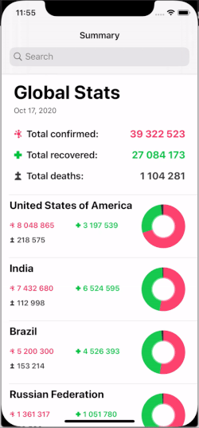
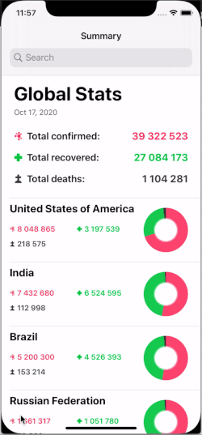

# CovidTracker

An application to let users search freely for Covid-19 data.

           Loading         ->          Summary Stats           ->         Country Detail 

       

##  Demo video
https://youtu.be/8dX1X5zNMZo

##  Requirements
- iOS 13+
- Xcode 11

##  Installation
Download the project and open ```CovidTracker.xcworkspace```.

##  Resources
- ``` SwiftLint ```: a tool to enforce Swift style and conventions. Keeping a codebase consistent and maintainable.
- ``` Moya ``` : a network abstraction layer that leverages Swift’s APIs like enums to make working with the network layer better than ever.

##  Structure
- MVVM: Model - View - ViewModel.
- SOLID principles.
- App flow: Loading -> Summary Stats -> Country Detail
   + ```LoadingViewController``` is usually use to load the inital data for application (first screen)
   + ```SummaryStatsViewController```, ```SummaryViewModel``` is related to Summary screen (second screen)
   + ```CountryDetailedStatsViewController```, ```CountryDetailedStatsViewModel``` is related to CountryDetail screen (third screen)
- Coordinator: to manage app's navigations. (``` Coordinator ``` protocol and ``` MainCoordinator ```)
- Adapter: to move data sources and delegates out of view controllers (``` SummaryStatsAdapter ```)
- Api services:
    + ```CovidService``` contains a provider which will be the main object that we will use to interact with any ```CovidTarget``` endpoints.
    + A Target (```CovidTarget```) should conforms to a protocol named ```TargetType```, which requires the entire endpoints informations. Our app has 2 main endpoints: ```fetchSummaryStats``` and ```fetchCountryDetails```
    + An enpoint information should contain baseUrl, header, path, parameters, method, task(make request), etc..
    ( by using enum, case by case, entirely type-safe 🎉.)
    
##  Unit Test Coverage

## That's it! Enjoy the app!
